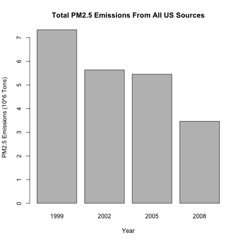
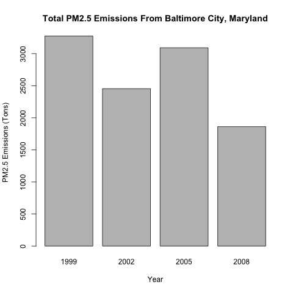
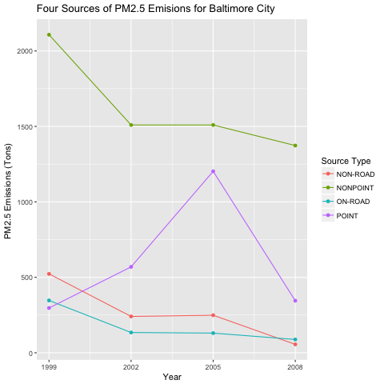
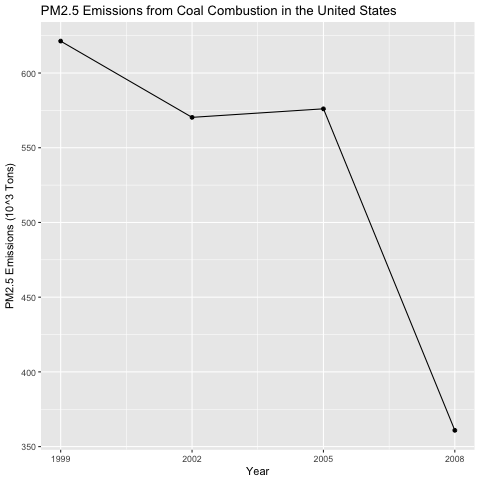
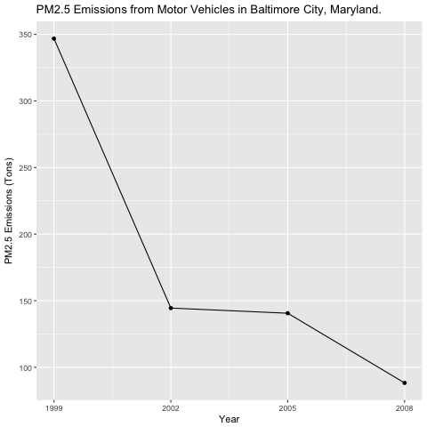
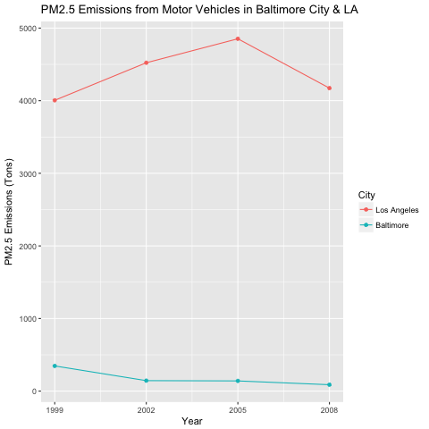

Exploratory Data Analysis - Course Project 2
============================================

# Introduction

Fine particulate matter (PM2.5) is an ambient air pollutant for which there is strong evidence that it is harmful to human health. In the United States, the Environmental Protection Agency (EPA) is tasked with setting national ambient air quality standards for fine PM and for tracking the emissions of this pollutant into the atmosphere. Approximatly every 3 years, the EPA releases its database on emissions of PM2.5. This database is known as the National Emissions Inventory (NEI). You can read more information about the NEI at the EPA National [Emissions Inventory web site](http://www.epa.gov/ttn/chief/eiinformation.html).

For each year and for each type of PM source, the NEI records how many tons of PM2.5 were emitted from that source over the course of the entire year. The data that you will use for this assignment are for 1999, 2002, 2005, and 2008.

# Data

The data for this assignment are available from the course web site as a single zip file:

* [Data for Peer Assessment [29Mb]](https://d396qusza40orc.cloudfront.net/exdata%2Fdata%2FNEI_data.zip)

The zip file contains two files:

PM2.5 Emissions Data (`summarySCC_PM25.rds`): This file contains a data frame with all of the PM2.5 emissions data for 1999, 2002, 2005, and 2008. For each year, the table contains number of tons of PM2.5 emitted from a specific type of source for the entire year. 

Source Classification Code Table (`Source_Classification_Code.rds`): This table provides a mapping from the SCC digit strings int he Emissions table to the actual name of the PM2.5 source. The sources are categorized in a few different ways from more general to more specific and you may choose to explore whatever categories you think are most useful. For example, source “10100101” is known as “Ext Comb /Electric Gen /Anthracite Coal /Pulverized Coal”.

# Assignment

The overall goal of this assignment is to explore the National Emissions Inventory database and see what it say about fine particulate matter pollution in the United states over the 10-year period 1999–2008.

### Question 1

**Have total emissions from PM2.5 decreased in the United States from 1999 to 2008?**

Total emissions from PM2.5 have decreased in the United States from 1999 to 2008.

 

### Question 2

**Have total emissions from PM2.5 decreased in the Baltimore City, Maryland (fips == "24510") from 1999 to 2008?**

Total emissions from PM2.5 have decreased in the Baltimore City, Maryland from 1999 to 2008.

 

### Question 3

**Of the four types of sources indicated by the type (point, nonpoint, onroad, nonroad) variable, which of these four sources have seen decreases in emissions from 1999–2008 for Baltimore City?**

**Which have seen increases in emissions from 1999–2008?**

In the Baltimore City, Maryland, the PM2.5 Emmisions Source types ON-ROAD, NON-ROAD and NONPINT have decreased from 1999 to 2008.

Emmisions from the source type "POINT" has been increases from 1999 to 2005 and again decreased in 2008. Not much overall change is observed for type "POINT".

 

### Question 4

**Across the United States, how have emissions from coal combustion-related sources changed from 1999–2008?**

Across the United States, PM2.5 emissions from coal combustion-related sources has decreased from 1999–2008.

 

### Question 5

**How have emissions from motor vehicle sources changed from 1999–2008 in Baltimore City?**

In Baltimore City, PM2.5 emissions from motor vehicle sources has decreased from 1999–2008

 

### Question 6

**Which city has seen greater changes over time in motor vehicle emissions?**

Baltimore City has much less PM2.5 emissions from motor vehicle sources than in LA. Also Baltimore City emmision has decreased from 1999–2008.

LA's PM2.5 emissions from motor vehicle sources has increased from 1999 to 2005, and then decreased from 2005 to 2008. But still the 2008 figure is higher than in 1999.

 

